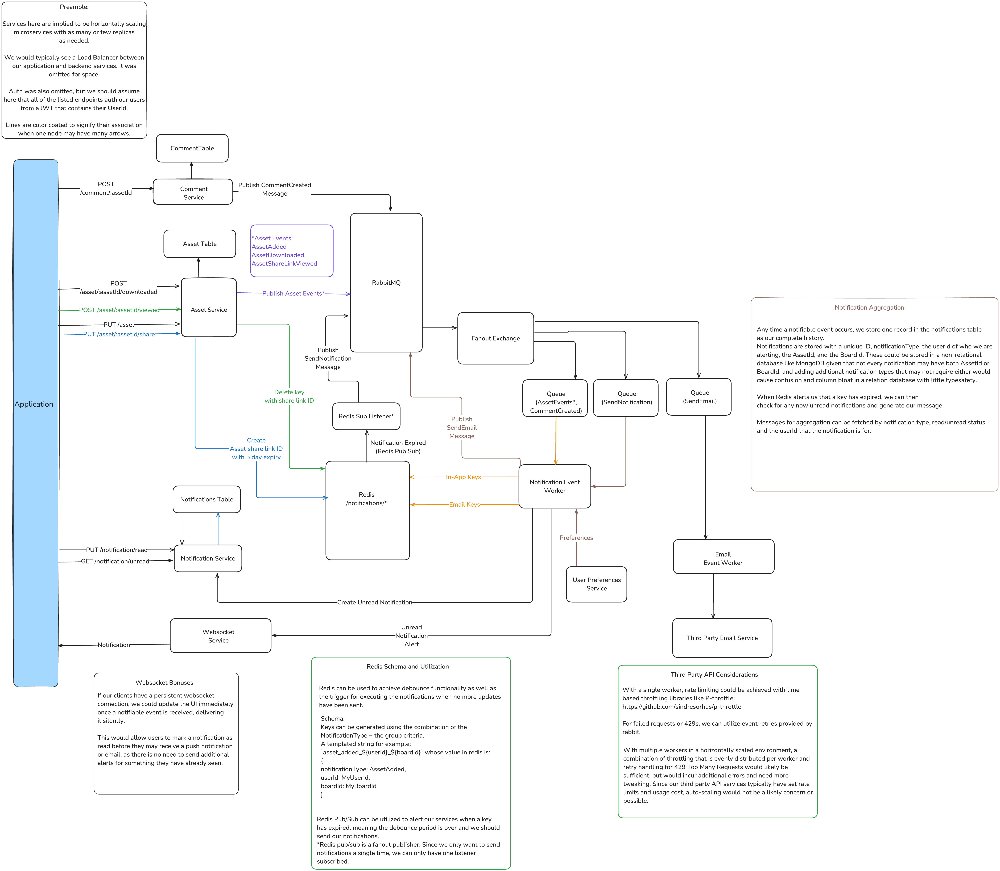

# Air - Unified Notifications

Excalidraw Diagram:

[https://link.excalidraw.com/l/5C66ek6qFt3/1ah3GABBkJA](https://link.excalidraw.com/l/5C66ek6qFt3/1ah3GABBkJA)



### High level implementation details

1. Our backend API is a series of microservices with their own database or tables.
2. Events for notifications are published to a RabbitMQ exchange and handled by any number of workers downstream that are listening to queues for our message types.
3. NotificationWorker stores our notifications in our persistent database and utilizes Redis for debouncing a given NotificationType + GroupOn key combination, with a key for both email and in-app notifications.
4. Using Redis Pub/Sub, an additional worker or service is alerted when our key has expired, meaning it is now time to send the aggregated notifications. 
    1. Redis Pub/Sub is a Fanout publisher. In order to prevent sending duplicate notifications, our listener for this service is restricted to one replica. In this design, we use this worker or service as a pass-through back into rabbitMQ, allowing us to leverage our horizontal workers again. 
    2. While I imagine there is some service that does both here allowing for the removal of this extra proxy worker, I am not aware of one that supports both TTL based pub/sub as well as run-once event listening. A polling approach instead of TTL pub/sub would allow Redis to be replaced, but still restrict you to one worker polling at a time as to prevent duplicate notifications.
5. Our notification worker (could be another worker as well) then sends in-app notifications and publishes an email event. The worker pulls and aggregates those notifications from our table that stores them **separately**. 
6. The email worker downstream should be scaled and throttled as needed to match the third-party API rate limits. Throttling can be done naively with one worker and on-machine throttling with a library such as P-Throttle. 

## Notification Data Models

For the given example, our notifications are guaranteed to have either an AssetId or BoardId. If we do not intend to have notification types stored in this database without either of those, our model stays consistent regardless of the notification type. If this were true, a relational choice like PostgresDB would be sufficient, and our table schema would be fairly rigid.

Assumption: An assetId belongs to a Board.

```tsx
export type NotificationType: 'assetUploaded' | 'assetLinkViewed' | 'commentCreated' 
                                                            | 'assetLinkNotViewed' | 'assetDownloaded'
export type Notification {
    id: string
    type: NotificationType
    forUserId: string // These IDs could also be branded types.
    assetId: string
    boardId: string
    read: boolean
    createdAt: Date
}
```

Additional considerations:

If we expand our possible notification types such that they no longer have an AssetId or BoardId, our schema and rigid relational model falls apart. In that case, adjusting the type to have a `meta` field as a JSONB would *work*, but other options like MongoDB may be preferable with a more flexible schema. In code, we could then subtype our notifications to give us type safety:

```tsx
export type NotificationType: 'assetUploaded' | 'assetLinkViewed' | 'commentCreated' 
                                                            | 'assetLinkNotViewed' | 'assetDownloaded'
export type BaseNotification{
    id: string
    type: NotificationType
    forUserId: string // These IDs could also be branded types.
    read: boolean
    createdAt: Date
}

export type AssetUploadedNotification = BaseNotification & {
 id: 'assetUploaded',
 specialField: string,
}

```

## Notification Aggregation

I opted for storing notifiable information per-row and providing the aggregation during runtime. This is more flexible for formatting changes and can be easily queried, rather than storing an aggregate in the database on its own.

This also has the benefit of potentially exposing real-time notifications to the client via web socket notifications, allowing the user to see and mark notifications as read before we send something that may be redundant, such as emailing them about something that they had already seen in the app when it occurred but before our debounce period. 

Considerations:

A table like this could grow very large, and scales quickly as it is per-user per-board. For large workspaces, one uploaded asset may need to alert many users, storing many records. 

While storage is cheap, a cleanup or expiration for this data may be needed. 

Tradeoffs:

Because we have to calculate our aggregation each time, how we expose this information in the application can dictate the backend complexity. Typically notifications are displayed within an application one at a time, while an aggregate is commonly used for when the user is not in the application. This would also allow for deep linking within an application via a displayed notification, something an aggregate could not do easily.

# REST API

### Router Design and Auth

Sample JWT based auth:

```tsx
 import jwt from 'jsonwebtoken'
 
 export type User = {
     id: string,
     email: string,
 }
 
 // Sample JWT based middleware, assuming our users have an authentication token
 // that contains their UserID and other cachable data like email. 
export function requireUser(request: Request, response: Response, next: NextFunction) {
    const { authorization } = request.headers
    
    if (!authorization) {
        response.status(401).send({error: 'Authentication Token Required'});
        return;
    }
    
    try {
        const decoded = jwt.verify(authorization, process.env.JWT_SECRET!) as { data: User };
        request.user = decoded.data;
        next()
    } catch (err) {
        if (err?.expiredAt) {
            response.status(401).send({error: 'Authentication Token Expired', expired: true})
            return
        }
        response.status(401).send({error: 'Authentication Token Invalid'})
    }
}
```

Router setup with middleware:

```tsx
 import { Router } from 'express'
 import { requireUser } from './auth'
 import { NotificationHandler } from './handlers/notification'
 
 const notificationRouter = Router({ mergeParams: true })
 // Authenticate our requests using our hypothetical auth method
 notificationRouter.use('/notification', requireUser)
 notificationRouter.get('/notification/unread', NotificationHandler.getAllUnread)
 notificationRouter.put('/notification/:notificationId/read', NotificationHandler.markRead)
```

## Notification Types and Database

### Notification Unread Route

```tsx
/*
* @returns the list of individual unread notifications for a user.
*/
export async function getAllUnread(request: Request, response: Response): Promise<Notification[]> {
    const userId = request.user.id
    // Hypothetical database and query library.
    const notifications: await this.database.select('notifications')
            .where( { forUserId: userId, read: false} ).orderBy({'createdAt': 'descending'})
    return notifications
}
```

Mark Notification Read route:

```tsx
/*
* Marks the notification as read in the database.
*/
export async function markRead(request: Request, response: Response): Promise<Notification[]> {
    const userId = request.user.id
    const notificationId = request.params.notificationId
    // Passing the userId provided by the token makes sure that a user cannot update
    // another users notification.
    await this.database.select('notifications')
            .where( { forUserId: userId, id: notificationId } ).update({ read: true })
}
```

### Additional Considerations:

1. Response pagination - Best practice would be to implement pagination when returning an unknown set of data. Since this is user created data, paginating notifications would be best.
2. Third Party notification services - Notifications can be complex, especially when websockets or real-time notifications become involved. In a real world case, I would first investigate in a third party API service that can support per-user data subscriptions, direct connection via websockets, sends emails, and supports push notifications. 
    1. [https://www.notificationapi.com/](https://www.notificationapi.com/) 
    2. [https://firebase.google.com/docs/cloud-messaging](https://firebase.google.com/docs/cloud-messaging)